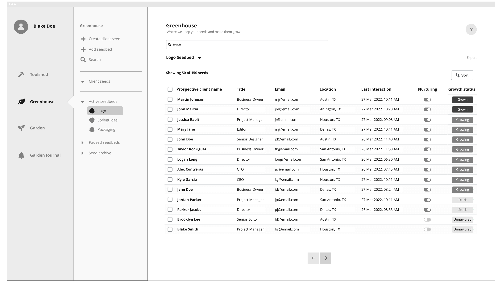
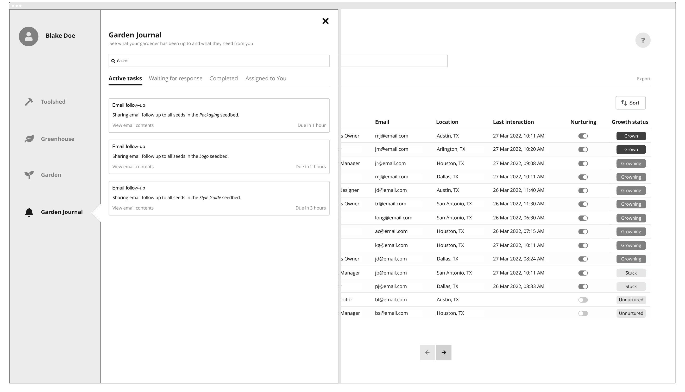

# Prueba Técnica - SoyDigi 🚀
### Front End Developer

--------------------------------------------------

### Antes de iniciar

   - Asegúrate de tener [Node.js](https://nodejs.org/es/download/) instalado.
   - deberás de crear una solución utilizando las librerías de [React](https://es.reactjs.org/) y [AntDesign](https://ant.design/docs/react/introduce) para desarrollar el módulo descrito en la prueba.
   - Para simular la integración con el back se  sugiere utilizar [Json Server](https://www.npmjs.com/package/json-server), el cual es un módulo que simula solicitudes a un Rest API para enfocarte en el front, se pueden realizar falsas solicitudes *GET*, *POST*, *DELETE*, etc. A partir de un archivo JSON.
   - La información necesaria para el desarrollo de la solución se dejará en una colección de datos, en formato JSON para poder ser utilizada con **Json Server** con nombre [db.json](./assets/data/db.json) ubicada en la carpeta /assets/data.
   - Se darán puntos extra por utilizar [TypeScript](https://www.typescriptlang.org/).

--------------------------------------------------

### Descripción

El desafío consiste en desarrollar un módulo dentro de una aplicación para la gestión de actividades de personas que trabajan como Freelancers, donde se desea mostrar las interacciones que los Freelancers han tenido con sus diferentes clientes. 

para el desarrollo de la prueba se proporcionarán **Wire Frames** del módulo a desarrollar, el cual tendrá dos funcionalidades básicas, explicadas a continuación.

   - la primera funcionalidad es la **gestión de información** en donde se gestiona los datos asociados a los clientes, a partir de solicitudes enviadas al API, se deberán de mostrar y desplegar los menús y submenús indicados en el wireframe, junto con la información de los clientes.
     

   - el menú **Active seedbeds** se deberá de completar a partir de la información retornada por el API.

   - la segunda funcionalidad a realizar es el **envío masivo de correos**. A continuación se muestra la pantalla que dispara el modal de envío masivo de correos.
     
     
   - sobre cada grupo de clientes o *seedbeds* mostrados en pantalla, se deberá de **desplegar un modal** mostrando una lista de personas a las que se enviará el correo, junto con el cuerpo de este (en este caso un *lorem ipsum*), no es necesario realizar el envio del correo, unicamente se debe de simular una solicitud al API para que se "encargue" y mostrar el mensaje de envío exitoso, al finalizar se debe de cerrar el modal.

   - Se podrá **filtrar** por varias opciones (name, title, email, location, etc), sin tener la necesidad de especificar sobre que campo se realiza la busqueda, y esta se debe de realizar dependiendo del texto ingresado.

   - El prototipo dado esta diseñado para una interfaz de escritorio, pese a no tener la versión móvil deberá de ser **Responsive** para diferentes resoluciones y tamaños de pantalla.

### Al completar el desafío

   - Deberás enviar la solución asociada a un repositorio de **GitHub**, el cual debe de ser publico y compartirnos el enlace, el codigo de la solución deberá de estar en la rama main.
   - Adicionalmente deberás de escribir un archivo **README** junto con las instrucciónes especificas y detalladas, para correr el programa. 

